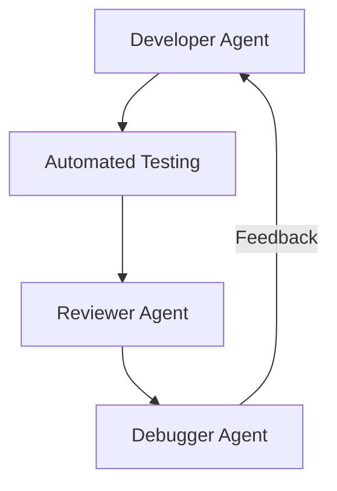

# Agentic CI Framework


## Features


## Quick Start
```bash
docker pull frdel/agent-zero-run
docker run -p 50001:80 frdel/agent-zero-run
# Visit http://localhost:50001
```

## Safety Protocols
- Always run in Docker containers
- Use least-privilege GitHub tokens
- Automatic timeout (30m max per agent)

[Full Documentation](docs/usage.md)