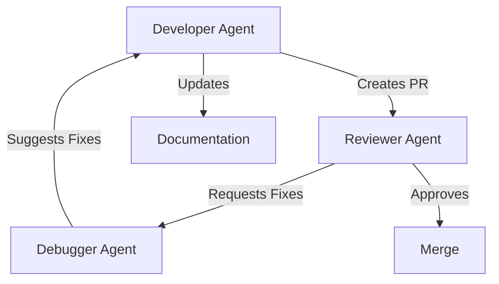

# Agentic CI Architecture

## System Components

## Workflow Sequence
1. Issue triggered development
2. Code creation with tests
3. Automated linting/checks
4. Review agent validation
5. Human maintainer approval