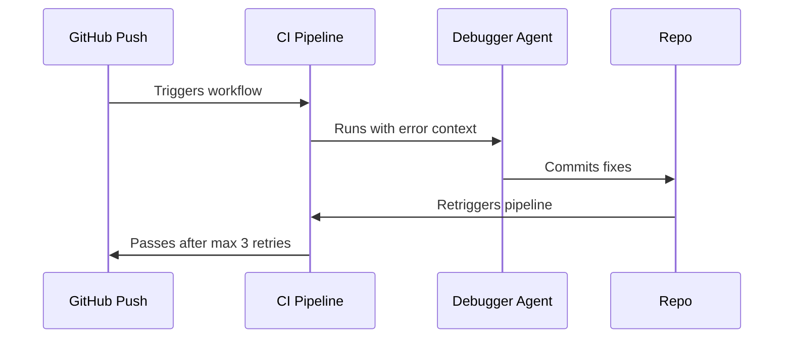

# Self-Healing CI Process

## Workflow

```mermaid
sequenceDiagram
    participant G as GitHub Push
    participant C as CI Pipeline
    participant D as Debugger Agent
    participant R as Repo
    G->>C: Triggers workflow
    C->>D: Runs with error context
    D->>R: Commits fixes
    R->>C: Retriggers pipeline
    C->>G: Passes after max 3 retries
```

## Safety Features
- Protected branch checks
- File modification allowlist
- Automatic rollback after 3 failures