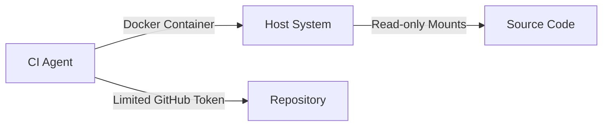

# Safety Protocols

## Isolation Guidelines

## Best Practices
- Always run agents with least-privilege tokens
- Use ephemeral containers for agent execution
- Implement automatic timeout (max 30m per agent task)