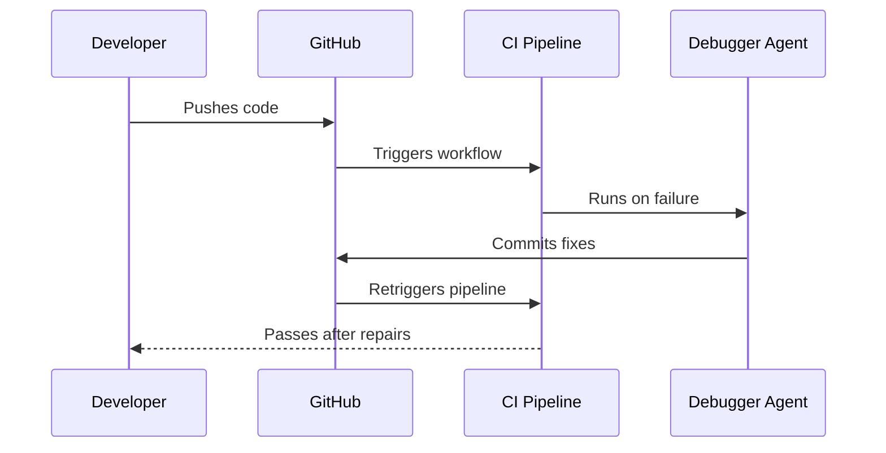

# Agentic CI Usage Guide

## Self-Healing Workflow

## Configuration Steps
1. Create GitHub PAT with `repo` scope
2. Add secret `AGENTIC_CI_PAT` in repo settings
3. Enable actions in repository permissions