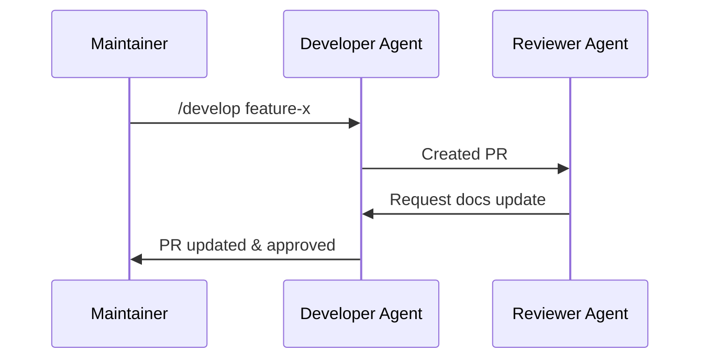

# Sample Implementation

```mermaid
sequenceDiagram
    participant M as Maintainer
    participant D as Developer Agent
    participant R as Reviewer Agent
    M->>D: /develop feature-x
    D->>R: Created PR#123
    R->>D: Request docs update
    D->>M: PR updated & approved
```